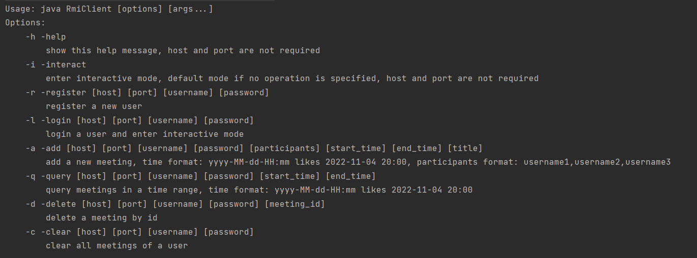
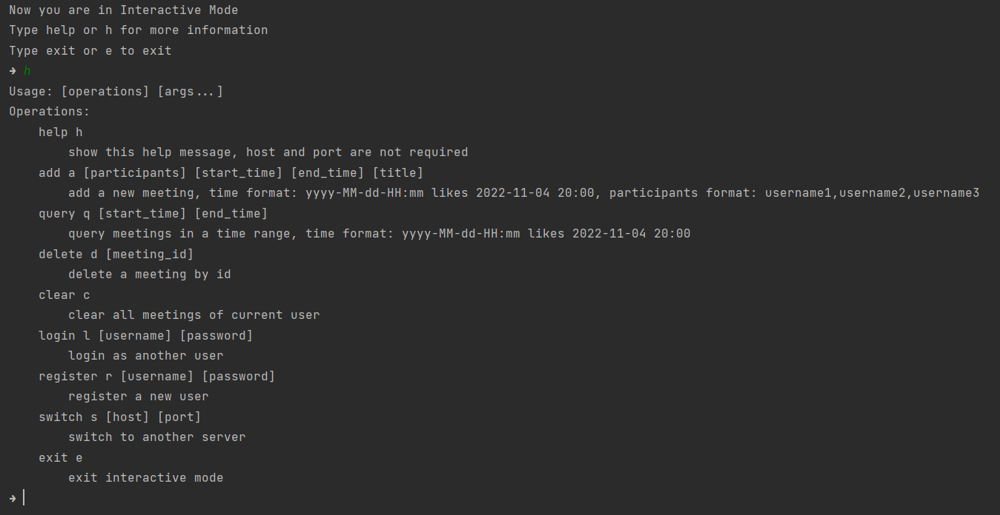

# 如何运行

先执行RmiServer, 指定端口参数 

`java RmiServer 1099`

客户端有两种模式, 一种是直接运行, 可以通过`java RmiClient -h`查看支持的命令格式

另一种是交互模式,会记住当前连接的服务器和登录状态

可以通过`-login`参数登录后进入或`-i`参数直接进入, 进入后键入help可获取帮助.通过-i直接进入需要执行switch选择服务器,login登录才能执行其他命令.

具体代码与实现说明见src与javadoc